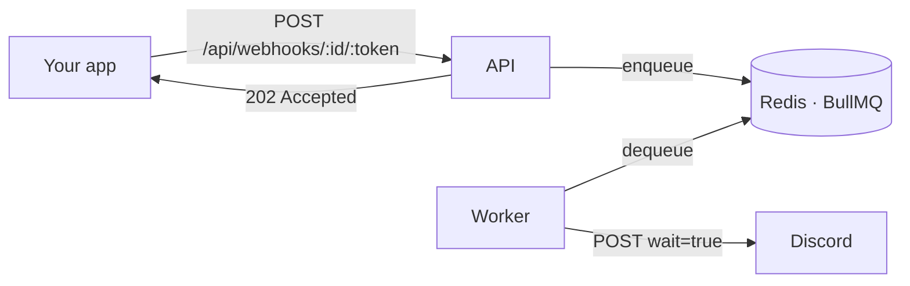

# CRX Discord Webhook

**English** · [Русский](README.ru.md)

[](https://github.com/cyrax-dev/CRXDiscordWebhook/actions/workflows/deploy.yml)

A self-hosted relay for Discord webhooks. It accepts the exact same payload Discord does, answers immediately, and takes care of the boring parts: queueing, retries, Discord's rate limits and backpressure.

**Public instance: [crx.lat](https://crx.lat)** — no signup, no key. Swap the host in your webhook URL and you're done:

```diff
- https://discord.com/api/webhooks/<id>/<token>
+ https://crx.lat/api/webhooks/<id>/<token>
```

## Why

Posting straight to Discord means your app owns every failure: a `429`, a 5xx, a network blip, a slow request blocking your handler. This relay takes the message off your hands in a few milliseconds and keeps trying on its own.



## Features

**Full webhook payload support** — everything Discord accepts, validated before it is queued:

- `content` (up to 2000 chars), `username`, `avatar_url`, `tts`
- `embeds` — up to 10 per message
- `components` — **buttons**, select menus, and **Components V2** layouts (`IS_COMPONENTS_V2`)
- `poll` — polls
- `attachments`, `allowed_mentions` (`parse`, `users`, `roles`, `replied_user`)
- `flags` — `SUPPRESS_EMBEDS`, `SUPPRESS_NOTIFICATIONS`, `IS_COMPONENTS_V2`
- Forum threads: `thread_name`, `applied_tags`, and `?thread_id=`

**Queue and delivery**

- BullMQ on Redis; the API only enqueues, a separate worker talks to Discord
- Up to 8 attempts with exponential backoff on 5xx and network errors
- Discord `429` is honoured exactly: the job is delayed by `retry_after` instead of being blindly retried
- A `4xx` from Discord is treated as unrecoverable — no pointless retries
- Requests are sent with `wait=true`, so the delivered message ID is confirmed by Discord
- Backpressure: when the backlog reaches `QUEUE_MAX_BACKLOG`, the API replies `503` instead of piling up

**Protection and operations**

- Per-IP rate limiting in Redis via an atomic Lua script, with `X-RateLimit-*` and `Retry-After` headers
- 64 KB payload cap
- Strict schema validation: snowflake patterns, length limits, unknown fields stripped
- Liveness and readiness endpoints
- Graceful shutdown on `SIGTERM`/`SIGINT` with a hard timeout
- Structured JSON logs
- 45 tests that gate the Docker image build in CI

## API

### `POST /api/webhooks/:id/:token`

Same path shape, query and body as Discord's own webhook endpoint.

| Part | Rules |
| --- | --- |
| `:id` | Discord snowflake, 17–20 digits |
| `:token` | 20–200 chars, `A-Z a-z 0-9 . _ -` |
| `?thread_id=` | optional snowflake |
| `?with_components=` | optional boolean |

```bash
curl -X POST https://crx.lat/api/webhooks/<id>/<token> \
  -H "Content-Type: application/json" \
  -d '{
    "content": "Deploy finished",
    "components": [
      {
        "type": 1,
        "components": [
          { "type": 2, "style": 5, "label": "Open build", "url": "https://example.com" }
        ]
      }
    ]
  }'
```

```json
{ "jobId": "0f5a1c4e-2b7c-4b3d-9a1e-6f1b2c3d4e5f", "status": "queued" }
```

| Status | When |
| --- | --- |
| `202` | Accepted and queued |
| `400` | Nothing to send (`content`, `embeds`, `components` and `poll` all empty), unsupported `flags`, or `IS_COMPONENTS_V2` mixed with `content`/`embeds`/`poll`/`attachments` |
| `422` | Payload does not match the schema |
| `429` | Per-IP rate limit exceeded — see `Retry-After` |
| `503` | Queue overloaded, or Redis unavailable |

### Health

| Endpoint | Meaning |
| --- | --- |
| `GET /health/live` | Process is up |
| `GET /health/ready` | Redis answers `PING` — ready to accept traffic |

## Good to know

Being upfront about the trade-offs of a queued design:

- **`202` means queued, not delivered.** If Discord later rejects the message (a malformed embed, a revoked webhook), the client is not notified — there is no job status endpoint yet.
- **Message order is not guaranteed.** Jobs run concurrently and retries are delayed, so two messages sent to the same webhook can arrive out of order.
- **The rate limit is per client IP**, not per webhook. Clients behind the same NAT share one budget.

## Running it

### Docker (recommended)

```bash
git clone https://github.com/cyrax-dev/CRXDiscordWebhook.git
cd CRXDiscordWebhook
cp .env.example .env
docker compose up -d
```

`compose.override.yaml` is picked up automatically and builds the image from source, so this works out of the box on a dev machine. The API listens on `8000` inside the `app` network; put a reverse proxy in front of it (see below).

### Local development

Needs Bun 1.3+ and a reachable Redis.

```bash
bun install
cp .env.example .env      # point REDIS_URL at your Redis

bun run dev               # API with hot reload
bun run dev:worker        # worker, in a second terminal
```

### Tests

```bash
bun test                  # 45 unit + integration tests, no Redis needed
bun run typecheck
bun run test:coverage
```

Integration tests replace the Redis-backed queue module with an in-memory double, so the whole suite runs offline in well under a second.

## Configuration

Every variable is required — the app hard-codes no fallbacks. `compose.yaml` supplies the defaults below.

| Variable | Default | Description |
| --- | --- | --- |
| `APP_PORT` | `8000` | HTTP port the API listens on |
| `REDIS_URL` | `redis://redis:6379` | Redis connection string |
| `WORKER_CONCURRENCY` | `5` | Jobs processed in parallel per worker |
| `DISCORD_REQUEST_TIMEOUT_MS` | `10000` | Timeout for a single Discord request |
| `JOB_MAX_ATTEMPTS` | `8` | Attempts before a job is marked failed |
| `SHUTDOWN_TIMEOUT_MS` | `15000` | Grace period before shutdown is forced |
| `RATE_LIMIT_MAX` | `100` | Requests per IP per window |
| `RATE_LIMIT_WINDOW_MS` | `60000` | Rate limit window |
| `QUEUE_MAX_BACKLOG` | `1000` | Pending jobs before the API returns `503` |
| `APP_IMAGE` | `ghcr.io/cyrax-dev/crx-discord-webhook:latest` | Image used in production |

## Deployment

Every push to `main` runs typecheck and tests first; only if they pass is the image built and pushed to GHCR as `:latest` and `:sha-<commit>`.

On the server, copy `compose.yaml`, `Caddyfile` and `.env` — but **not** `compose.override.yaml`, so the image comes from the registry instead of a local build:

```bash
docker compose pull
docker compose up -d
```

Reverse proxy example (Caddy):

```caddyfile
webhook.example.com {
    @webhooks path /api/webhooks/*

    request_body @webhooks {
        max_size 64KB
    }

    log_skip @webhooks

    reverse_proxy crx-discord-webhook:8000 {
        header_up X-Real-IP {remote_host}
    }
}
```

`X-Real-IP` matters: without it every request looks like it comes from the proxy, and they all share a single rate limit bucket.

Redis stores the queue, so it runs with `appendonly yes` and `maxmemory-policy noeviction` — losing keys here means losing undelivered messages.

## Stack

[Bun](https://bun.com) · [Elysia](https://elysiajs.com) · [BullMQ](https://bullmq.io) · Redis · Docker
