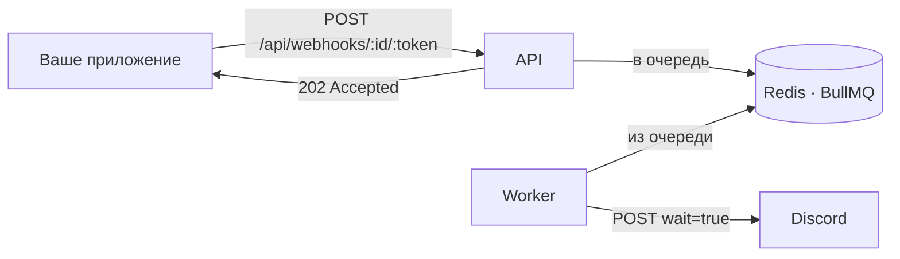

# CRX Discord Webhook

[English](README.md) · **Русский**

[](https://github.com/cyrax-dev/CRXDiscordWebhook/actions/workflows/deploy.yml)

Прокси для вебхуков Discord, который можно поднять у себя. Принимает ровно тот же payload, что и Discord, отвечает сразу и берёт на себя скучное: очередь, повторы, лимиты Discord и защиту от перегрузки.

**Публичный инстанс: [crx.lat](https://crx.lat)** — без регистрации и ключей. Достаточно поменять хост в URL вебхука:

```diff
- https://discord.com/api/webhooks/<id>/<token>
+ https://crx.lat/api/webhooks/<id>/<token>
```

## Зачем

Когда приложение стучится в Discord напрямую, все сбои — его проблема: `429`, 5xx, обрыв сети, медленный запрос, который держит обработчик. Прокси забирает сообщение за несколько миллисекунд и дальше разбирается сам.



## Возможности

**Полная поддержка payload вебхука** — всё, что принимает Discord, проверяется до постановки в очередь:

- `content` (до 2000 символов), `username`, `avatar_url`, `tts`
- `embeds` — до 10 на сообщение
- `components` — **кнопки**, селекты и раскладки **Components V2** (`IS_COMPONENTS_V2`)
- `poll` — опросы
- `attachments`, `allowed_mentions` (`parse`, `users`, `roles`, `replied_user`)
- `flags` — `SUPPRESS_EMBEDS`, `SUPPRESS_NOTIFICATIONS`, `IS_COMPONENTS_V2`
- Форумные ветки: `thread_name`, `applied_tags` и `?thread_id=`

**Очередь и доставка**

- BullMQ поверх Redis: API только кладёт задачу, в Discord ходит отдельный worker
- До 8 попыток с экспоненциальной паузой на 5xx и сетевых ошибках
- `429` от Discord отрабатывается честно: задача откладывается ровно на `retry_after`, а не повторяется вслепую
- `4xx` от Discord считается неисправимым — бессмысленных повторов нет
- Запрос уходит с `wait=true`, поэтому ID доставленного сообщения подтверждает сам Discord
- Защита от перегрузки: когда в очереди накопилось `QUEUE_MAX_BACKLOG` задач, API отвечает `503`, а не копит дальше

**Защита и эксплуатация**

- Лимит запросов по IP в Redis через атомарный Lua-скрипт, с заголовками `X-RateLimit-*` и `Retry-After`
- Ограничение тела запроса в 64 КБ
- Строгая валидация схемой: паттерны snowflake, лимиты длины, неизвестные поля вырезаются
- Эндпоинты liveness и readiness
- Корректное завершение по `SIGTERM`/`SIGINT` с жёстким таймаутом
- Структурированные JSON-логи
- 45 тестов, без которых в CI не соберётся образ

## API

### `POST /api/webhooks/:id/:token`

Путь, query и тело — те же, что у оригинального эндпоинта Discord.

| Часть | Правила |
| --- | --- |
| `:id` | snowflake Discord, 17–20 цифр |
| `:token` | 20–200 символов, `A-Z a-z 0-9 . _ -` |
| `?thread_id=` | опционально, snowflake |
| `?with_components=` | опционально, boolean |

```bash
curl -X POST https://crx.lat/api/webhooks/<id>/<token> \
  -H "Content-Type: application/json" \
  -d '{
    "content": "Деплой завершён",
    "components": [
      {
        "type": 1,
        "components": [
          { "type": 2, "style": 5, "label": "Открыть сборку", "url": "https://example.com" }
        ]
      }
    ]
  }'
```

```json
{ "jobId": "0f5a1c4e-2b7c-4b3d-9a1e-6f1b2c3d4e5f", "status": "queued" }
```

| Код | Когда |
| --- | --- |
| `202` | Принято и поставлено в очередь |
| `400` | Нечего отправлять (`content`, `embeds`, `components` и `poll` пусты), неподдерживаемые `flags` или `IS_COMPONENTS_V2` вместе с `content`/`embeds`/`poll`/`attachments` |
| `422` | Payload не соответствует схеме |
| `429` | Превышен лимит по IP — смотрите `Retry-After` |
| `503` | Очередь переполнена или Redis недоступен |

### Health

| Эндпоинт | Что значит |
| --- | --- |
| `GET /health/live` | Процесс жив |
| `GET /health/ready` | Redis отвечает на `PING` — готов принимать трафик |

## Что важно знать

Честно о компромиссах схемы с очередью:

- **`202` — это «принято», а не «доставлено».** Если Discord потом отклонит сообщение (кривой embed, удалённый вебхук), клиент об этом не узнает — эндпоинта статуса задачи пока нет.
- **Порядок сообщений не гарантирован.** Задачи обрабатываются параллельно, повторы откладываются, поэтому два сообщения в один вебхук могут прийти в обратном порядке.
- **Лимит считается по IP клиента**, а не по вебхуку. Клиенты за одним NAT делят общий бюджет.

## Запуск

### Docker (рекомендуется)

```bash
git clone https://github.com/cyrax-dev/CRXDiscordWebhook.git
cd CRXDiscordWebhook
cp .env.example .env
docker compose up -d
```

`compose.override.yaml` подхватывается автоматически и собирает образ из исходников, поэтому на рабочей машине всё заводится сразу. API слушает `8000` внутри сети `app` — снаружи его закрывает обратный прокси (см. ниже).

### Локальная разработка

Нужны Bun 1.3+ и доступный Redis.

```bash
bun install
cp .env.example .env      # укажите свой REDIS_URL

bun run dev               # API с hot reload
bun run dev:worker        # worker, во втором терминале
```

### Тесты

```bash
bun test                  # 45 unit- и интеграционных тестов, Redis не нужен
bun run typecheck
bun run test:coverage
```

Интеграционные тесты подменяют модуль очереди на in-memory двойник, поэтому весь набор проходит офлайн меньше чем за секунду.

## Конфигурация

Все переменные обязательны — значений по умолчанию в коде нет, их задаёт `compose.yaml`.

| Переменная | По умолчанию | Описание |
| --- | --- | --- |
| `APP_PORT` | `8000` | Порт, который слушает API |
| `REDIS_URL` | `redis://redis:6379` | Строка подключения к Redis |
| `WORKER_CONCURRENCY` | `5` | Сколько задач worker обрабатывает параллельно |
| `DISCORD_REQUEST_TIMEOUT_MS` | `10000` | Таймаут одного запроса в Discord |
| `JOB_MAX_ATTEMPTS` | `8` | Попыток, прежде чем задача считается упавшей |
| `SHUTDOWN_TIMEOUT_MS` | `15000` | Сколько ждать перед принудительным завершением |
| `RATE_LIMIT_MAX` | `100` | Запросов с одного IP за окно |
| `RATE_LIMIT_WINDOW_MS` | `60000` | Длина окна лимитера |
| `QUEUE_MAX_BACKLOG` | `1000` | Задач в очереди, после чего API отвечает `503` |
| `APP_IMAGE` | `ghcr.io/cyrax-dev/crx-discord-webhook:latest` | Образ для продакшена |

## Деплой

На каждый push в `main` сначала гоняются typecheck и тесты, и только если они прошли, образ собирается и уезжает в GHCR тегами `:latest` и `:sha-<commit>`.

На сервер кладутся `compose.yaml`, `Caddyfile` и `.env` — но **не** `compose.override.yaml`, иначе образ будет собираться локально вместо загрузки из реестра:

```bash
docker compose pull
docker compose up -d
```

Пример обратного прокси (Caddy):

```caddyfile
webhook.example.com {
    @webhooks path /api/webhooks/*

    request_body @webhooks {
        max_size 64KB
    }

    log_skip @webhooks

    reverse_proxy crx-discord-webhook:8000 {
        header_up X-Real-IP {remote_host}
    }
}
```

`X-Real-IP` здесь важен: без него все запросы выглядят как пришедшие от прокси и делят один бюджет лимитера.

Redis хранит очередь, поэтому запускается с `appendonly yes` и `maxmemory-policy noeviction` — потеря ключей здесь означает потерю недоставленных сообщений.

## Стек

[Bun](https://bun.com) · [Elysia](https://elysiajs.com) · [BullMQ](https://bullmq.io) · Redis · Docker
